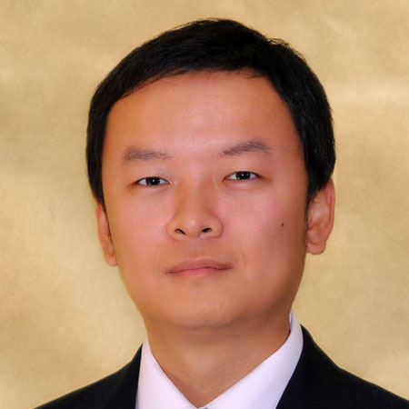

## About me

I'm an Associated Professor and a Ph.D. supervisor affiliated with the School of Computer & Information Technology of Beijing Jiaotong University. 
In my research works I was working in the areas of communication theories and techniques, including  massive MIMO, space-time coding, Turbo receiver, optical fiber communications and Internet of Things. 
I'm now interested in the research of 5G techniques and wireless big data.

---

## Education

* **Ph.D.**			Electrical Engineering,   March 2011      
				Institut National des Sciences Appliquées (INSA) Rennes
* **Master**		Information and Communication Engineering,   June 2007            
				Xi’an Jiaotong University
* **Bachelor**		Information Engineering,   July 2004                 
				Xi’an Jiaotong University

---
## Skill

* **Telecom**:		
				massive-MIMO, OFDM, space-time coding, iterative process, channel estimation, random access, physical layer security, optical fiber communications 
* **Systems**:
			GSM, LTE, DVB-T/T2/NGH, DTMB 
* **AI**: 
			hands on experience on typical machine learning models, e. g. CNN, auto-encoder, GAN	
* **Tools**:	
			MATLAB, Python, C, C++, JAVA, Agilent Advanced Design System (ADS)
* **Language**:	
		English (fluent), French (fluent), Chinese (mother tongue) 

---
## Advising
* **Master students**:
	- Xiaoyi Wang (2015-2017), *now working in China Railyway Fifth Survey and Design Institute Group Co.Ltd. 
			Xiaoyi Wang’s thesis won the **Excellent Master Thesis Prize** of School of Computer & Information Technology of Beijing Jiaotong University.*
	- Qing Wang (2015-2018, co-advised with Prof. Zhangdui Zhong), 
	- Li Xu (2016-2019), 
	- Nian Liu (2017-2020), 
	- Yawen Zheng (2017-2020), 
	- Lanlan Wei (2017-2019), 
	- Baigong Xu (2017-2019), 
	- Junxia Zhang (2018-2021), 
	- Xiaoyi Han (2018-2021), 
	- Jiaxin Ren (2018-2021).

* **Ph.D. student**:
Participate in the direction (together with Prof. Maryline Hélard and Prof. Fabienne Nouvel) of the research of Miss Rida El Chall, Ph.D candidate in INSA-Rennes, on the subjects of low-complexity soft-input soft-output MIMO detector and turbo receivers

---
## Award
- 2021	China Railway Society Science and Technology Progress Award, Second Prize (4/20)
- 2020	Excellent Bachelor thesis prize of Beijing Jiaotong University (for Mr. Lei Zhang’s thesis)
- 2019	Excellent Bachelor thesis prize of Beijing Municipal (for Mr. Cihang Cheng’s thesis)
- 2019	Huawei Prize (two recipients each year in BJTU)
- 2018	Watchdata Prize 
- 2017 	Excellent Master thesis prize of School of Computer & Information Technology of Beijing Jiaotong University (for Miss Xiaoyi Wang’s thesis)

---
## Contact
 
Email: mingliu [AT] bjtu.edu.cn 

### Address

> Beijing Jiaotong University
>
> No.3 Shangyuancun, Haidian District
>
> Beijing, 100044,
> P. R. China

