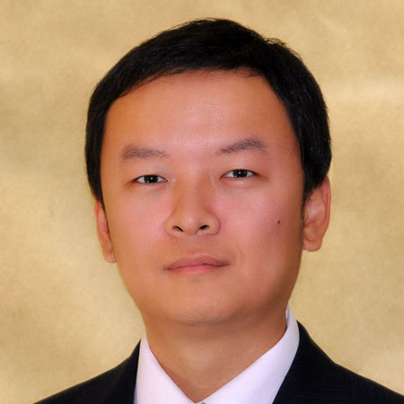

## About Me

I'm an Associate Professor and a Ph.D. supervisor affiliated with the School of Computer & Information Technology of Beijing Jiaotong University. 
In my research works I was working in the areas of communication theories and techniques, including **ambient IoT**, **physical layer identification**, **massive MIMO**, space-time coding, Turbo receiver and optical fiber communications. 
I'm now interested in the application of the recent advances of AI to the fundamental problems in communication systems.

---

## Education

* **Ph.D.**		Electrical Engineering,   2011      
				Institut National des Sciences Appliquées (INSA) Rennes, France
* **M.E.**		Information and Communication Engineering,   2007            
				Xi’an Jiaotong University, China
* **B.E.**		Information Engineering,   2004                 
				Xi’an Jiaotong University, China

---
## Skill

* **Telecom**:		
			Passive	backscatter communication, RF interference cancellation, massive-MIMO, OFDM, space-time coding, channel estimation, random access, physical layer security, optical fiber communications  
* **Systems**:
			GSM, LTE, RFID, DVB-T/T2/NGH, DTMB 
* **AI**: 
			Hands-on experience on typical machine learning models, e.g. CNN, auto-encoder, GAN, transformer	
* **Tools**:	
			MATLAB, Python, C/C++, JAVA
* **Language**:	
			English (working language), French (fluent), Chinese (mother tongue) 

---
## Advising
* **Current Master students**:
	- Yuxuan Xu (2021-2024)
	- Hui Luo (2022-2024)
	- Jiali Xia (2022-2024)
	- Nian Wang (2022-2025)
	- Bingjie Jiang (2023-2026)

* **Graduated Mater students**:
	- Xiaoyi Wang (2015-2017), *now at China Railway Fifth Survey and Design Institute Group*, **Outstanding Master Thesis**
	- Qing Wang (2015-2018, co-advised with Prof. Z.D. Zhong), *now at Huawei Technologies* 
	- Li Xu (2016-2019), *now at People's Bank of China* 
	- Nian Liu (2017-2020), *now at China Merchants Bank* 
	- Yawen Zheng (2017-2020), *now at Huaxia Bank* 
	- Lanlan Wei (2017-2019), *now at Chinese Academy of Sciences* 
	- Mingshan Zhang (2017-2020, co-advised with Prof. Z.D. Zhong), *now at Intel Research Center* 
	- Junxia Zhang (2018-2021), *now at Huaxia Bank*, **Outstanding Graduate**
	- Xiaoyi Han (2018-2021), *now at Beijing Urban Construction Design & Development Group Co., Limited*
	- Jiaxin Ren (2018-2021), *now at Ali Baba Network Technology Co., Ltd*
	- Cihang Cheng (2019-2022), *now at China Telecom System Integration Co., Ltd.*, **Municipal Outstanding Graduated Student**
	- Tianzhuang Zhang (2019-2022), *now at ByteDance*

* **Ph.D.**:
	- Rida El Chall (2012-2015, in assistance to Prof. Maryline Hélard and Prof. Fabienne Nouvel, INSA-Rennes) 

---
## Teaching
* **“Assembly Language & Computer Interface”**   
	64 hours undergraduate course in BJTU, since 2017 fall

* **“Algorithms”**                
	24 hours postgraduate course in BJTU, since 2019 fall

* **“Electronics”**
	63 hours undergraduate experiment course in INSA-Rennes in 2013	
	
	Obtained teaching qualification in French universities (“*La qualification aux fonctions de maître de conférences*”, section 61, in the field of computer science, automatics & signal processing) 

---
## Award
- 2022  **Beijing Municipal Higher Education Achievement Award**, **Second Prize** (4/15)
- 2021  **Special Award for Undergraduate Teaching Achievement of Beijing Jiaotong University**, (4/15)
- 2021  **Undergraduate Education Achievement Award of Beijing Jiaotong University**, **Second Prize** (1/6), (2/5)
- 2021  **Postgraduate Education Achievement Award of Beijing Jiaotong University**, **First Prize** (8/11)
- 2021	**China Railway Society Science and Technology Progress Award**, **Second Prize** (4/20)
- 2020	**Excellent Bachelor thesis prize of Beijing Jiaotong University** (for Mr. Lei Zhang’s thesis)
- 2019	**Excellent Bachelor thesis prize of Beijing Municipal** (for Mr. Cihang Cheng’s thesis)
- 2019	**Huawei Prize** 
- 2018	**Watchdata Prize** 
- 2017 	**Excellent Master thesis prize of the School of Computer & Information Technology of Beijing Jiaotong University** (for Miss Xiaoyi Wang’s thesis)

---
## Contact
 
Email: xjtumliu [AT] gmail.com 

<!-- ### Address

> Beijing Jiaotong University
>
> No.3 Shangyuancun, Haidian District
>
> Beijing, 100044,
> P. R. China -->

