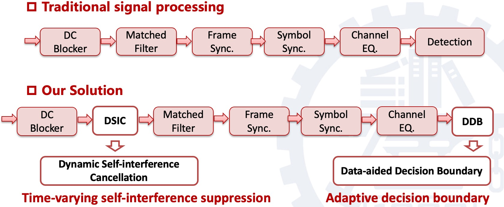
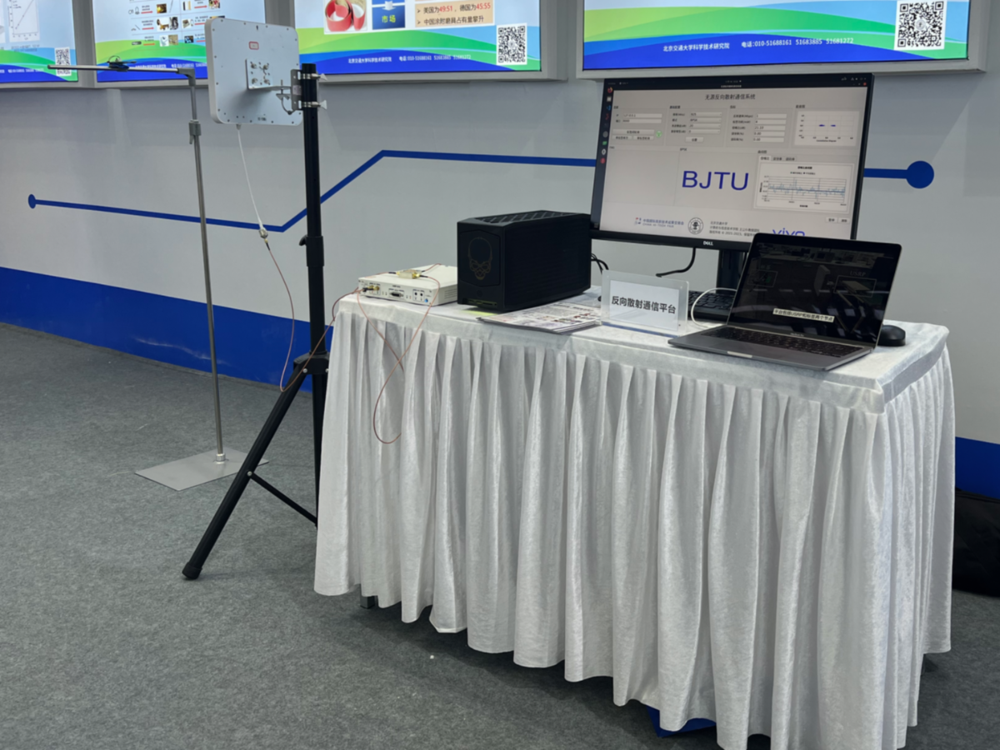
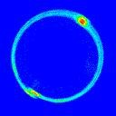
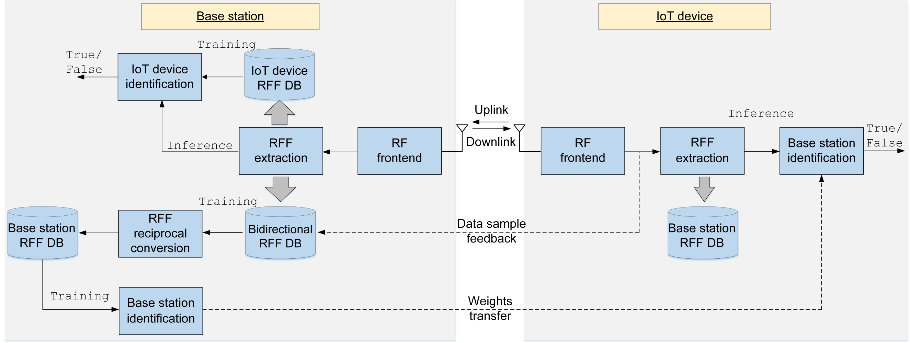
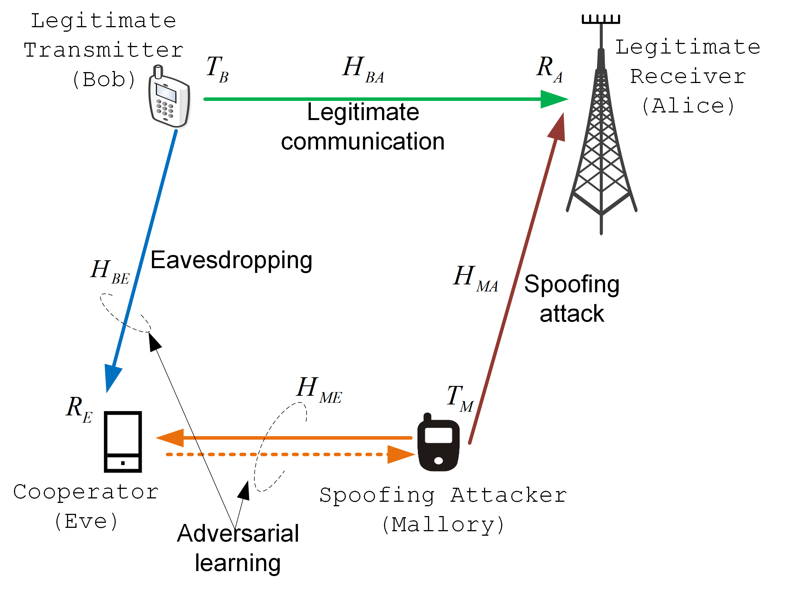
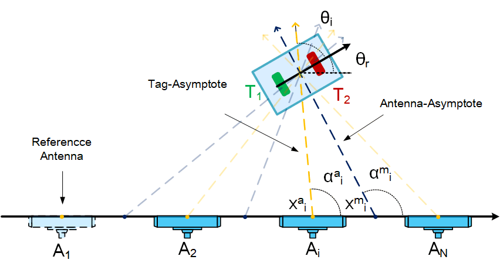

## Research Experience
---
### Backscatter Communication for Ambient IoT 
*National Science Foundation of China (NSFC)* & *Industry-sponsored research projects*, **co-technical leader**, *ongoing*
* <U>Project Objective</U>: Devise backscatter communication techniques for ambient IoT 
	- Long-range passive backscatter communication 

		Communication over long-range has always been a major challenge for passive backscatter devices due to the round-trip channel attenuation nature of the backscatter communication. The classical UHD RFID system can usually cover a range of <10 m. 3GPP started investigating the low rate backscatter communication over 50 m in its new study item "<em>Study on solutions for Ambient IoT in NR</em>" with a potential target on Release-19. Our research efforts lie in the joint optimization of frame structure, multiple access and transceiver design. More details of our vision can be found in our 3GPP document entitled "Multiple access and backscatter consideration for R19 ambient IoT" (<a href="https://www.3gpp.org/ftp/tsg_ran/TSG_RAN/TSGR_102/Docs/RP-233518.zip">3GPP RP-233518</a>). 
	<figure>
	   	
	   	<figcaption><U>Our proposal of receiver structure for advanced backscatter communication</U>.</figcaption>
	</figure>
	- High-speed passive backscatter communication over a range of meters 

		The classical UHD RFID system only supports a communication rate of several to a few hundred kbps, which limits the backscatter communication in simple data collection applications like inventory and tracking. The backscatter communication technology can be envisioned to be applied in more energy-constrained scenarios with higher data-rate requirements. We developed an SDR-based hardware platform with baseband signal processing techniques including detection, synchronization, equalization, interference cancellation, demodulation etc. Accordingly, we are continuously improving the hardware of our own backscatter devices (advanced backscatter tags) to achieve higher communication rates. Experimental results show that the hardware platform can communicate with our tag at transmission rates as high as 5~10 Mbps over a range of a few meters.
	<figure>
	   	5 Mbps rate over air interface.' style="width:400px;" />
	   	<figcaption><U>Backscatter communication platform with >5 Mbps rate over air interface</U>.</figcaption>
	</figure>
	
	- RF self-interference cancellation (SIC) for mono-static backscatter communications

		The information transmission between a backscatter device (i.e. a "tag" in classic RFID system) and a backscatter interrogator (a.k.a. a "reader") is carried out by changing the reflection status of the incident RF carrier wave in the mono-static backscatter communications. The carrier wave leaking from the Tx to Rx of the reader due to the imperfect isolation of the circulator introduces significant interference in the received RF backscatter signal, causing severe RF self-interference. This RF self-interference constitutes the most prominent performance bottleneck of the mono-static backscatter communication. This project aims to design hardware and algorithms to realize RF self-interference cancellation of the backscatter system. Experimental results show that the implemented RF SIC platform can achieve over 45 dB interference cancellation performance. 	

---
### Identification of Wireless Internet of Things (IoT) Device Based on Radio Frequency Fingerprint
*National Science Foundation of China (NSFC)*, **PI**，*01/2020 – 12/2023*
* <U>Project Objective</U>: Design device fingerprinting techniques to support the new device identification mechanism for IoT devices. 
Various IoT applications are penetrating many aspects of our daily life. IoT is integrating with cutting-edge technologies such as artificial intelligence, big data, and cloud computing to form the cornerstone of the future intelligent living environment. However, due to the openness of the wireless communication medium and the limited hardware and network resources, how to efficiently identify IoT devices becomes more and more important from both the efficiency and security perspectives of the network. This project will research the theory and methodology of identifying IoT devices using the device fingerprints inherent in wireless devices. 
	- **Robust radio frequency fingerprint (RFF) extraction**

		Existing researches on RFF mainly focus on extracting unique features caused by certain device imperfections (e.g. carrier frequency offset, I/Q imbalances, nonlinearity, frequency response, etc.), and visualizing them through some processing (e.g. Fourier, wavelet, Hilbert-Huang transforms and correlations). Recent advances have adopted machine learning techniques to identify the visualized features. However, most works considered only one feature. Hence, they are not resilient to channel uncertainty, and the capacity of identification is limited. This work will propose new machine learning models that integrate multiple signal features to achieve higher identification accuracy and robustness. 

	<figure>
	    
	    <figcaption><U>An example of differential constellation trace figure</U>.</figcaption>
	</figure>

	- **Bidirectional device identification based on RFF for IoT scenarios**

		Existing researches on Radio Frequency Fingerprint (RFF) mainly focus on unilateral device identification in one communication direction. However, in practice, it is difficult for IoT devices to identify the base station due to their hardware insufficiencies. This work investigates the bidirectional device identification method for IoT application scenarios. The inherent reciprocity of the communication pair's RFFs is studied and exploited to offload the learning process, which is supposed to be proceeded by the IoT device, to the base station. The autoencoder-based RFF reciprocal conversion network is devised to predict the downlink RFF based on the data samples acquired in the uplink, so that the training process of the downlink identification network can be accomplished by the base station and the computational complexity of IoT devices is reduced. Evaluations with real-world data show that, the IoT devices can achieve a high accuracy to identify the base station using the identification network trained by the base station. 

	<figure>
	    
	    <figcaption><U>A bidirectional device identification framework</U>.</figcaption>
	</figure>

	- **RFF impersonation and countermeasures**

		RFF may be impersonated by adversaries to circumvent the authentication method. Anti-spoofing techniques (e.g. liveness detection) have been investigated for similar authentication mechanisms such as facial or fingerprint recognition. However, the detection of RFF impersonation attacks is highly insufficient in the existing research. This work will study the possibility that malicious users impersonate legitimate users' RFF by adversarial learning. To overcome the problem that each device, including the legitimate users and malicious users, has unique hardware imperfections in both transmission and reception circuits and the response caused by these imperfections can hardly be calibrated by the device itself, this work proposes to introduce a cooperative attacker that serves as a 'spectator' or 'critic' to help the malicious users to impersonate their RFFs. A Generative Adversarial Network (GAN) based cooperative RFF spoofing method is proposed, which can generate high-fidelity RFFs that look alike to the targeted legitimate users. Countermeasures will be proposed to effectively detect the RFF spoofing or increase the sophistication of RFF that can incapacitate the RFF impersonation attacks.  
	<figure>
	    
	    <figcaption><U>Spoofing attack with a cooperative attacker</U>.</figcaption>
	</figure>
	
---
### Reliable Transmission Techniques in the Massive MIMO Systems for 5G
*National Science Foundation of China (NSFC)*, **PI**, *01/2016 – 12/2018*
* <U>Project Objective: Research key physical layer techniques for reliable and scalable massive MIMO system
	- Physical layer security technique to prevent pilot contamination attack

		The pilot contamination phenomenon is seen as the bottleneck of the performance of massive MIMO, but also contains serious information security breaches. We research different methods to detect the pilot contamination attack from active eavesdroppers. A simple detection method based on the transmission of random symbols from mobile terminals is proposed. As the number of receive antennas goes large, the distribution of the phase differences of received random symbols converges to a set of finite regions. Once contaminated by the active attackers, the phase difference distribution is disturbed, which is exploited to detect the existence of an active attacker. In a further study, we research to use the random matrix theory to characterize the distribution of the eigenvalues of the random symbols which also converges to a series of sectors. The boundary of the sectors can be determined in a theoretical way. This property is employed to detect active attackers. 
	- Massive uplink connections in massive MIMO system

		The random access of massive concurrent Internet-of-Thing devices becomes a major challenge for the future mobile communication network. We seek the possibility of exploiting the great spatial degrees of freedom brought by the massive MIMO technique. The small-scale fading channels of concurrent users sharing the same band are converted to a scalar form after the simple Maximal Ratio Combining (MRC). The overlapped users’ symbols are then recovered using the iterative interference canceller as long as the received powers of different users exhibit significant differences. The random access of multiple concurrent users is turned into a power allocation problem. It is proved that the proposed random access scheme can support around a 300% system overload ratio. 

---
### 5G End-to-End Performance Optimization for Hybrid Service Scenarios
*Nokia Bell Labs project*, **technical leader**, *04/2017 – 03/2018*
* <U>Project Objective</U>: Propose radio resource management strategy for future mobile communication networks
	- Main research activities
		+ Investigate traffic characteristics of future wireless networks in typical application scenarios
		+ Research the method of radio resource management with more flexible manners and finer granularity
		+ Evaluate the proposed schemes on the calibrated simulation platform

---
### Spatial Localization based on RFID
*ZhongJing Co., Ltd. sponsored project*, *PI*, *03/2018 - 06/2022*
* <U>Project Objective</U>: Devise deep learning-based algorithm to determine the location of RFID labels for potential IoT applications including automatic dispatch systems and high-accuracy indoor positioning
	- AI-based 1-D localization for automatic dispatch systems
		+ Acquire large amounts of RFID signal samples, clean data, annotate labels
		+ Training deep neural networks
	- High-accuracy 2-D localization based on dual RFID tags and antenna array
	<figure>
	    
	    <figcaption><U>High-accuracy localization based on dual RFID tags and antenna array.</U>.</figcaption>
	</figure>

---
### Machine-to-machine communications via cellular networks
*Orange Labs project*, **researcher**, *06/2014 – 01/2015*
* <U>Project Objective</U>: Propose energy-efficient solutions to deliver M2M communications over the GSM system
	- Evaluation of physical layer performance of the GSM/GPRS/EDGE systems

		The MATLAB-based simulation chain contains the main features of GSM with different Modulation Coding Schemes (MCS) and channel models. The implemented receiver algorithms include the optimal maximum-likelihood sequence estimation (MLSE) detector, the sub-optimal reduced-state sequence estimation (RSSE) and decision-feedback detectors, as well as the linear detectors.

---
### High-speed data transmission in low-cost optical fiber systems
*IETR internal project*, **researcher**,  *06/2013 – 01/2015*
* <U>Project Objective</U>: Propose high-efficiency, low-complex transmission schemes for the Polymer Optical Fiber (POF) systems
	- Proposal of a high-performance PN-ZP-DMT transmission scheme

		The proposed PN-ZP-DMT scheme is based on the DMT technique and combines the advantages of PN- and ZP-based guard intervals. It employs the pseudo-noise (PN) sequences to obtain accurate channel estimation and reduces the transmission power through the use of zero padding (ZP) guard intervals. The proposed scheme achieves a transmission data rate of 1.5 Gbps over a 50-meter experimental POF system, which represents the highest transmission rate reported in the literature.

---
### STBC design for distributed MIMO systems
*French ANR project “Mobile Multi-Media”(M3)* & *European CELTIC project “ENGINES”*, **researcher**, *04/2011 – 12/2013*
* <U>Project Objective</U>: Propose effective MIMO encoding and decoding algorithms for future broadcasting system
	- Proposal of a new form of the 3D MIMO codeword

		I proposed to permute the positions of information symbols so that the orthogonality is ‘concentrated’ in the first 4 information symbols. The resulting new 3D MIMO codeword is therefore fast-decodable. It is among the least complex STBCs with the same code rate and diversity. The new code is robust to the ‘near-far problem’ in distributed MIMO.
	- Proposal of a short version 3D MIMO code

		The new code has a coding rate of 2 (full-rate, 4 information symbols within 2 channel uses). It requires much less complexity than 3D MIMO code with negligible performance loss. It achieves the best trade-off between performance and complexity with different channel coding configurations.
	- Proposal of a new fast-decodable DjABBA code

		The new code is full-rate, full-diversity for 4×2 MIMO transmission. It requires the lowest ML decoding complexity among the fast decodable STBCs. The proposed codeword possesses the highest coding gain and has the best BER performance among STBCs.
	- Proposal of an ML decoder for original and new 3D MIMO codes

		The simplified decoder is realized by a four-level tree-search followed by four parallel decisions, yielding a complexity order of 4:5. It provides the ML performance and requires less processing time than the classical sphere decoder with Schnorr-Euchner enumeration.

---
### Channel estimation for PN-OFDM based systems
*French “Mobile TV World” project*, **researcher**, *10/2007 – 03/2011*
* <U>Project Objective: Propose high-performance channel estimation techniques for the PN-OFDM based systems
	- Proposal of several PN-correlation-based channel estimation techniques

		I proposed the time domain channel estimation techniques exploiting the unique correlation properties of m-sequences. I also proposed several improved estimators that reduce estimation error floor caused by the imperfect correlation results of PN sequences. The proposed PN-based channel estimation methods achieve good performance in typical channel conditions with low implementation complexity.
	- Proposal of an iterative data-aided channel estimation technique with low complexity

		I proposed an iterative data-aided channel estimation technique which is used in combination with PN-based estimation to handle the harsh channel conditions (such as the cases of SFN). In contrast to the classical ‘Turbo channel estimation’, data symbols are directly rebuilt based on the soft information output from the demapper to reduce complexity. The rebuilt ‘soft’ data symbols serve as a training sequence for a second channel estimation. The data-aided channel estimation results are refined using moving average or Wienner filtering techniques. The PN-based and data-aided channel estimation results are combined according to their estimation accuracies and the resulting new channel estimation will be used to decode the information in the next iteration. The overall system performance is significantly improved with only a few iterations.

